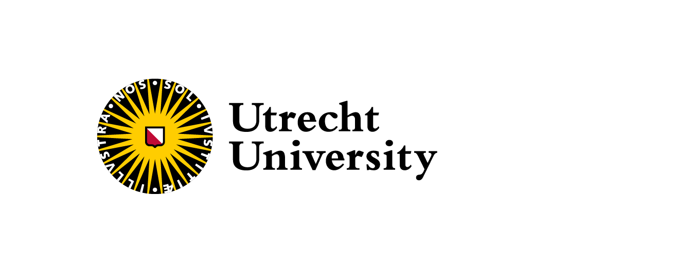

# Transformers: Applications in Language and Communication



This website accompanies the [Utrecht University](https://www.uu.nl/en) [Applied Data Science Master](https://www.uu.nl/en/masters/applied-data-science) course **Transformers: Applications in Language and Communication**.  

> This course introduces you to Transformers, introduced in
> [this 2017
> paper](https://https://proceedings.neurips.cc/paper_files/paper/2017/file/3f5ee243547dee91fbd053c1c4a845aa-Paper.pdf). With
> the release of ChatGPT in November 2022, the Transformer, the T in
> GPT, firmly took position as the number one working horse in AI. It
> changed the field of natural language processing (the field of this
> course's lecturers) overnight, and its revolutionary industrial
> impact might be huge and lasting. Yet, the working horse at its core
> can only do one thing: *predict the next word*. How is this possible
> and how does it work? What are the problematic aspects of this
> technology and what are the current developments?

The [Applied Data Science Master](https://www.uu.nl/en/masters/applied-data-science) program is a one-year Master program. The live course is held yearly in February-April. The current webpages reflect the course content from the 2025 issue.

The content was created by [Antal van den
Bosch](https://antalvandenbosch.nl/), [Lisa
Bylinina](https://bylinina.github.io/), Yingjin Song, and [Yupei
Du](https://yupei.nl/). We took an effort in properly quoting and
crediting content of others; please notify [Antal van den
Bosch](mailto:a.p.j.vandenbosch@uu.nl) in case the current material
needs a correction or a credit.

Some of the [Jupyter Notebooks](https://jupyter.org/) accompanying the
course (that have been optimized to run on [Google
Colab](https://colab.research.google.com/)) are based on the notebooks
that came with the book [Natural Language Processing with
Transformers](https://www.oreilly.com/library/view/natural-language-processing/9781098136789/)
by Lewis Tunstall, Leandro von Werra, and Thomas Wolf. Other sources
of inspiration are quoted in the respective lecture slides and Jupyter
notebooks.

The images containing imaginary Transformer bots in various lab or
outside settings were created in
[Midjourney](https://www.midjourney.com/home), with prompts that
always included "1950s science fiction book cover style".

```{tableofcontents}
```
